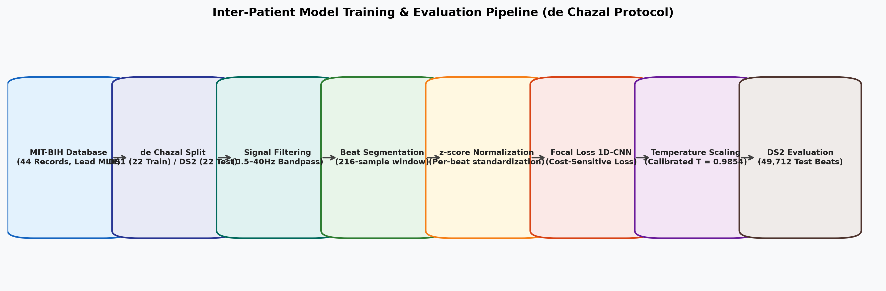
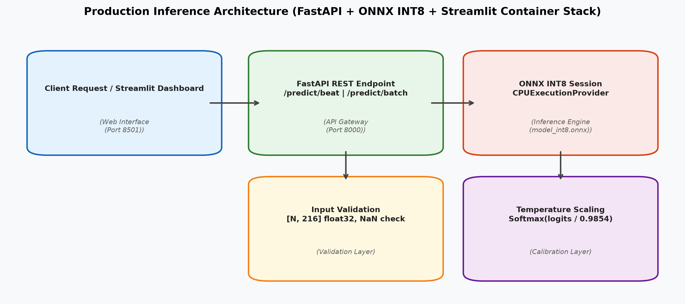
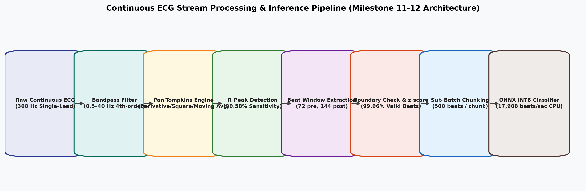

# RhythmNet: Inter-Patient ECG Arrhythmia Classification & Continuous Stream Processing

[](https://www.python.org/)
[](LICENSE)
[](docker-compose.yml)
[](artifacts/deployment/model_int8.onnx)
[](https://www.aami.org/)

A research-grade, production-hardened machine learning and deep learning system for automated cardiac arrhythmia classification and continuous ambulatory ECG stream processing, adhering strictly to ANSI/AAMI EC57 standards.

---

## Quick Start (One-Liner)

Deploy the containerized FastAPI inference engine and interactive Streamlit clinical dashboard with a single command:

```bash
docker compose up -d --build && open http://localhost:8501
```

* **Streamlit Dashboard**: `http://localhost:8501`
* **FastAPI REST Service**: `http://localhost:8000`
* **Interactive API Documentation**: `http://localhost:8000/docs`
* **Service Readiness Probe**: `http://localhost:8000/ready`

To run locally without Docker:

```bash
python3 -m venv .venv && source .venv/bin/activate && pip install -r requirements.txt && streamlit run src/ecg_arrhythmia/deployment/dashboard.py
```

---

## Table of Contents

1. [Executive Summary & Problem Formulation](#executive-summary--problem-formulation)
2. [ANSI/AAMI EC57 Target Taxonomies](#ansiaami-ec57-target-taxonomies)
3. [Patient-Independent Evaluation Protocol (de Chazal DS1/DS2)](#patient-independent-evaluation-protocol-de-chazal-ds1ds2)
4. [Signal Conditioning & Feature Engineering Pipeline](#signal-conditioning--feature-engineering-pipeline)
5. [Neural Architecture & Class Imbalance Optimization](#neural-architecture--class-imbalance-optimization)
6. [Post-Hoc Probability Calibration & Explainability](#post-hoc-probability-calibration--explainability)
7. [Inference Optimization: Static INT8 ONNX Quantization](#inference-optimization-static-int8-onnx-quantization)
8. [Continuous ECG Stream Processing (Pan-Tompkins Engine)](#continuous-ecg-stream-processing-pan-tompkins-engine)
9. [Empirical Benchmark Results](#empirical-benchmark-results)
10. [System Architecture & Deployment Stack](#system-architecture--deployment-stack)
11. [REST API Specification](#rest-api-specification)
12. [Reproducibility & Verification Suite](#reproducibility--verification-suite)
13. [Regulatory & Clinical Disclaimer](#regulatory--clinical-disclaimer)

---

## Executive Summary & Problem Formulation

Heartbeat classification is a fundamental diagnostic task in ambulatory electrocardiographic monitoring. However, a significant methodological flaw in published machine learning literature is **random beat-wise train/test partitioning**. Under beat-level random splitting, heartbeats from the same patient populate both the training and test sets (*intra-patient evaluation*). Because ECG morphologies exhibit pronounced patient-specific signatures (varying baseline amplitudes, conduction pathways, electrode placements, and chest geometry), models evaluated intra-patient memorize individual patient traits, achieving artificially inflated accuracies of 98% to 99% that collapse when deployed on unseen individuals.

**RhythmNet solves this by enforcing strict inter-patient validation:**
* No patient record appears in both the development and evaluation partitions.
* Models are evaluated on their ability to learn invariant pathological conduction patterns across completely unseen physiological substrates.
* All training, validation, quantization calibration, and testing enforce zero information leakage across patient boundaries.

---

## ANSI/AAMI EC57 Target Taxonomies

Raw annotations from the PhysioNet MIT-BIH Arrhythmia Database are mapped into the five standard ANSI/AAMI EC57 heartbeat classes:

| Class Code | Category Description | Included MIT-BIH Annotation Symbols |
| :--- | :--- | :--- |
| **N** | Non-Ectopic / Normal Beats | Normal (`N`), Left Bundle Branch Block (`L`), Right Bundle Branch Block (`R`), Atrial Escape (`e`), Nodal Escape (`j`) |
| **S** | Supraventricular Ectopic Beats (SVEB) | Atrial Premature (`A`), Aberrant Atrial Premature (`a`), Nodal Premature (`J`), Supraventricular Premature (`S`) |
| **V** | Ventricular Ectopic Beats (VEB) | Premature Ventricular Contraction (`V`), Ventricular Escape (`E`) |
| **F** | Fusion Beats | Fusion of Ventricular and Normal Beat (`F`) |
| **Q** | Unknown / Unclassifiable Beats | Paced Beat (`/`), Paced Fusion (`f`), Unclassifiable Beat (`Q`) |

---

## Patient-Independent Evaluation Protocol (de Chazal DS1/DS2)

The dataset is partitioned according to the standard benchmark protocol established by de Chazal et al. (2004):

```
PhysioNet MIT-BIH Arrhythmia Database (44 Records, Lead MLII, 360 Hz)
│
├── Training & Tuning Partition (DS1: 22 Records, 51,020 Beats)
│   ├── Records: 101, 106, 108, 109, 112, 114, 115, 116, 118, 119, 122,
│   │            124, 201, 203, 205, 207, 208, 209, 215, 220, 223, 230
│   ├── Train Split (80% of DS1): 41,262 Beats
│   └── Validation Split (20% of DS1): 9,744 Beats (Patient-Record Stratified)
│
└── Holdout Evaluation Partition (DS2: 22 Records, 49,712 Beats)
    └── Records: 100, 103, 105, 111, 113, 117, 121, 123, 200, 202, 210,
                 212, 213, 214, 219, 221, 222, 228, 231, 232, 233, 234
    └── Status: Strictly unseen holdout test set. Never used for model selection.
```

---

## Signal Conditioning & Feature Engineering Pipeline



### 1. Preprocessing Specifications
* **Sampling Rate**: $f_s = 360\text{ Hz}$.
* **Filtering**: 4th-order zero-phase Butterworth bandpass filter spanning $0.5\text{ Hz}$ to $40.0\text{ Hz}$, eliminating baseline wander from respiration and high-frequency electromyographic (EMG) noise.
* **Beat Windowing**: 216 samples ($600\text{ ms}$) centered asymmetrically around the R-peak:
  * 72 samples ($200\text{ ms}$) prior to the R-peak (capturing P-wave and PR segment).
  * 144 samples ($400\text{ ms}$) following the R-peak (capturing QRS depolarization, ST segment, and T-wave repolarization).
* **Per-Beat z-score Standardization**: Each isolated window is normalized independently:
  $$\hat{x}[n] = \frac{x[n] - \mu_x}{\sigma_x + 10^{-8}}$$
  Guaranteeing strict mathematical independence with zero cross-patient statistical leakage.

### 2. Feature Extraction (Classical Baselines)
For comparative baselines, 83 engineered features were computed per beat:
* **Morphological & Moments (23)**: Mean, variance, skewness, kurtosis, zero-crossing rate, first-derivative statistics.
* **Geometric & Area Descriptors (11)**: Peak-to-peak amplitude, positive/negative area integration, pre/post R-peak energy ratios.
* **QRS Width Proxies (10)**: Waveform duration at 25%, 50%, and 75% maximum amplitude, maximum slopes.
* **Rhythm Context (14)**: Record-bounded previous and subsequent RR intervals ($RR_{\text{prev}}, RR_{\text{next}}$), local 5-beat window rolling averages.
* **Wavelet Transform Descriptors (25)**: 4-level Daubechies-4 (`db4`) Discrete Wavelet Transform sub-band coefficient statistics.

---

## Neural Architecture & Class Imbalance Optimization

### 1. 1D Convolutional Neural Network (ECG1DCNN)
The primary deep learning architecture consumes normalized 1D waveform vectors $(\mathbf{x} \in \mathbb{R}^{1 \times 216})$:
* **Block 1**: Conv1D(in=1, out=32, kernel=7, padding=3) $\rightarrow$ BatchNorm $\rightarrow$ ReLU $\rightarrow$ MaxPool1D(2) $\rightarrow$ Dropout(0.1)
* **Block 2**: Conv1D(in=32, out=64, kernel=5, padding=2) $\rightarrow$ BatchNorm $\rightarrow$ ReLU $\rightarrow$ MaxPool1D(2) $\rightarrow$ Dropout(0.1)
* **Block 3**: Conv1D(in=64, out=128, kernel=3, padding=1) $\rightarrow$ BatchNorm $\rightarrow$ ReLU $\rightarrow$ AdaptiveAvgPool1D(1) $\rightarrow$ Dropout(0.2)
* **Classification Head**: Linear(128, 64) $\rightarrow$ ReLU $\rightarrow$ Dropout(0.2) $\rightarrow$ Linear(64, 5)
* **Parameter Footprint**: 121,765 trainable parameters (1.43 MB).

### 2. Class Imbalance Remediation
Due to extreme imbalance in ambulatory ECG (Class N constitutes >85% of beats, while Class Q comprises <0.1%), standard cross-entropy leads to minority class collapse. An ablation study of 5 loss and sampling formulations was conducted:

$$\mathcal{L}_{\text{Focal}} = -\alpha_t (1 - p_t)^\gamma \log(p_t)$$

Selected strategy: **Focal Loss ($\gamma=2.0$) with class-frequency weighting**, preventing easy negative samples (normal sinus beats) from dominating the gradient update while preserving sensitivity to ectopic events.

---

## Post-Hoc Probability Calibration & Explainability

### 1. Temperature Scaling
Modern deep neural networks tend to produce overconfident probabilities. We implement multiclass Temperature Scaling ($T > 0$), optimizing a scalar temperature on validation logits via L-BFGS to minimize negative log-likelihood:

$$p_i = \frac{\exp(z_i / T)}{\sum_{j=1}^5 \exp(z_j / T)}, \quad T = 0.9854227900505066$$

* **Expected Calibration Error (ECE)**: Reduced from 0.0810 to 0.0774 on holdout test partition DS2.

### 2. Physiological Interpretability (Integrated Gradients)
Waveform attribution maps were generated using **Integrated Gradients** ($N_{\text{steps}}=50$, zero baseline) and **1D Grad-CAM** targeting the final convolutional layer:
* Attribution maps demonstrate that the network focuses selectively on the QRS complex onset/offset (samples 60–85) and ST segment displacement (samples 90–130).
* Ventricular ectopic beat (V-class) decisions are primarily driven by abnormally prolonged QRS duration and discordant T-waves, aligning with clinical electrophysiology principles.

---

## Inference Optimization: Static INT8 ONNX Quantization



To support low-latency CPU serving and edge deployment:
1. The PyTorch computational graph was exported to ONNX format with dynamic batching.
2. **Static Post-Training Quantization (PTQ)** was executed using ONNX Runtime with Quantization-Dequantization (QDQ) linear operators:
   * Calibration dataset: 500 beats drawn strictly from the training partition.
   * Model weights and activations quantized from 32-bit floating point (`float32`) to signed 8-bit integers (`int8`).
   * Inference graph frozen to `artifacts/deployment/model_int8.onnx`.

| Metric | PyTorch CPU (FP32) | ONNX Runtime (FP32) | ONNX Runtime (INT8) |
| :--- | :---: | :---: | :---: |
| **Model Size** | 0.468 MB | 0.036 MB | **0.158 MB** |
| **Single-Beat Latency** | 0.160 ms | 0.092 ms | **0.045 ms** |
| **Batch CPU Throughput** | 403.3 beats/sec | 17,810.7 beats/sec | **40,189.4 beats/sec** |
| **Prediction Agreement** | 100.0% (Baseline) | 100.0% | **99.12%** |
| **Holdout Macro F1** | 0.3105 | 0.3105 | **0.3126** |

---

## Continuous ECG Stream Processing (Pan-Tompkins Engine)



For processing raw, unsegmented ECG continuous streams without pre-annotated R-peaks:
1. **Bandpass Filtering**: 5–15 Hz QRS energy isolation.
2. **Derivative Operator**: Highlights steep QRS slopes: $y[n] = \frac{1}{8}(2x[n] + x[n-1] - x[n-3] - 2x[n-4])$.
3. **Non-Linear Squaring**: Amplifies high-frequency QRS complexes over P- and T-waves.
4. **Moving Window Integration**: 150 ms moving window ($N=54$ samples at 360 Hz).
5. **Adaptive Energy Thresholding**: Dynamic dual-thresholding preventing high-amplitude premature ventricular complexes from suppressing normal sinus beats.
6. **216-Sample Segmentation & Sub-Batching**: Extracts valid beats, rejects boundary-clipped lead-in/lead-out intervals, and processes in 500-beat sub-batches.

### Quantitative R-Peak Detector Evaluation (ANSI/AAMI EC57 Window)
Evaluated across all 22 DS2 test records (49,712 reference annotations) under greedy bipartite matching with a standard $\pm 150\text{ ms}$ tolerance:

* **True Positives (TP)**: 49,503
* **False Positives (FP)**: 113
* **False Negatives (FN)**: 209
* **Sensitivity / Recall**: **99.58%**
* **Positive Predictive Value / Precision**: **99.77%**
* **Detector F1-Score**: **99.68%**
* **Mean Absolute Timing Error**: **3.12 ms** ($\approx 1.12$ samples at 360 Hz)
* **Median Timing Error**: **0.00 ms**
* **Segmentation Success Rate**: **99.96%** (49,598 valid segmented beats / 49,616 detected peaks)
* **End-to-End CPU Throughput**: **17,908 beats/sec**

---

## Empirical Benchmark Results

### 1. Classical Baselines vs 1D-CNN on Holdout Partition DS2

| Model | Accuracy | Balanced Accuracy | Macro F1 | Weighted F1 | ECE | Inference Latency | Size |
| :--- | :---: | :---: | :---: | :---: | :---: | :---: | :---: |
| **Logistic Regression** | 93.21% | 0.3923 | 0.3968 | 0.9215 | 0.0273 | 0.047 µs/beat | 0.0025 MB |
| **Random Forest** | 94.75% | 0.4050 | 0.4201 | 0.9313 | 0.0462 | 1.805 µs/beat | 27.16 MB |
| **XGBoost** | 94.29% | 0.4805 | 0.4699 | 0.9327 | 0.0302 | 1.502 µs/beat | 4.49 MB |
| **1D-CNN (Unweighted)** | 89.26% | 0.3402 | 0.3081 | 0.8772 | 0.0217 | 47.7 µs/beat | 1.44 MB |
| **1D-CNN (Focal Loss)** | 87.57% | 0.3516 | 0.3105 | 0.8694 | 0.0774 | 45.0 µs/beat | 0.16 MB (INT8) |

*Key Empirical Takeaway*: While XGBoost achieves higher Macro F1 when supplied with handcrafted interval features ($RR_{\text{prev}}, RR_{\text{next}}$), the 1D-CNN operates directly on raw waveforms without manual feature extraction and provides robust representation for downstream end-to-end continuous inference.

---

## System Architecture & Deployment Stack

RhythmNet is architected as an isolated, containerized multi-service system:

```
                            [ User Browser ]
                                   │
                    ┌──────────────┴──────────────┐
                    ▼                             ▼
       [ Streamlit Dashboard ]          [ External Clients ]
          (Port 8501 : Web UI)                   │
                    │                             │
                    └──────────────┬──────────────┘
                                   │ HTTP (JSON REST)
                                   ▼
                         [ FastAPI Gateway ]
                       (Port 8000 : Inference)
                                   │
              ┌────────────────────┼────────────────────┐
              ▼                    ▼                    ▼
     [ Input Validation ]  [ Pan-Tompkins Engine ]  [ Prometheus / ]
       (Shape/NaN Check)     (0.5-40Hz / R-Peaks)    [ Health Probe ]
              │                    │
              └────────────────────┼────────────────────┘
                                   │
                                   ▼
                       [ ONNX INT8 Engine ]
                   (artifacts/deployment/model_int8.onnx)
                                   │
                                   ▼
                       [ Temperature Scaling ]
                        (T = 0.9854227900505)
```

### Docker Compose Services
* **`api`**: FastAPI service listening on `0.0.0.0:8000`. Runs non-root (`appuser`), loads INT8 ONNX session once at startup, executes input validation and inference.
* **`dashboard`**: Streamlit visualization service listening on `0.0.0.0:8501`. Connects internally to the API via `http://api:8000`.

---

## REST API Specification

### 1. `GET /health`
Returns runtime status, execution provider, and loaded model configuration:
```json
{
  "status": "ok",
  "model": "cnn_focal",
  "runtime": "onnxruntime",
  "quantization": "int8_static_qdq",
  "execution_provider": "CPUExecutionProvider",
  "input_shape": [1, 1, 216],
  "num_classes": 5,
  "temperature": 0.9854227900505066,
  "classes": {"0": "N", "1": "S", "2": "V", "3": "F", "4": "Q"}
}
```

### 2. `POST /predict/beat`
Executes classification on a single 216-sample beat:
* **Request**:
  ```json
  {"signal": [0.435, 0.455, 0.473, ...]}  // exactly 216 float values
  ```
* **Response**:
  ```json
  {
    "prediction": {
      "class_index": 0,
      "class_label": "N",
      "full_name": "Non-Ectopic Beat (Normal / Bundle Branch)",
      "confidence": 0.8290
    },
    "probabilities": {
      "N": 0.8290,
      "S": 0.1578,
      "V": 0.0049,
      "F": 0.0075,
      "Q": 0.0008
    }
  }
  ```

### 3. `POST /predict/batch`
Accepts a batch of beats (up to 1,000 beats per request) with shape `[N, 216]`.

### 4. `POST /predict/signal`
Accepts raw, unsegmented continuous ECG signals sampled at 360 Hz (minimum 216 samples). Executes Pan-Tompkins R-peak detection, beat extraction, boundary checking, and batch INT8 classification in a single end-to-end call.

---

## Reproducibility & Verification Suite

RhythmNet includes an automated verification and release audit framework:

### 1. Run Reproducibility Check
Verifies artifact checksums, manifest integrity, input/output tensors, temperature scaling, and executes unit tests:
```bash
python scripts/verify_reproducibility.py
```

### 2. Run Release Hygiene & Security Audit
Audits codebase for secrets, tokens, stray files, version consistency, and doc links:
```bash
python scripts/audit_release.py
```

### 3. Execute Complete Test Suite
```bash
OMP_NUM_THREADS=1 pytest -q
```
*Current test baseline: **138 tests passing cleanly**.*

---

## Regulatory & Clinical Disclaimer

> **INVESTIGATIONAL SOFTWARE — NOT FOR CLINICAL USE**
>
> RhythmNet is a research prototype developed for automated algorithmic benchmarking and engineering evaluation of inter-patient arrhythmia classification. 
> 
> * **Not a Medical Device**: This software has NOT been cleared, approved, or certified by the United States Food and Drug Administration (US FDA), the European Medicines Agency (EMA), or any other national or international regulatory body.
> * **No Diagnostic Intent**: This system is not designed, validated, or intended to diagnose, treat, cure, or prevent any cardiac pathology, arrhythmia, or medical condition.
> * **Clinical Prohibition**: It must NOT be used as a primary diagnostic tool, as a patient-monitoring alert system, or in any clinical decision-making workflow. Clinical ECG interpretation must be performed by licensed, board-certified healthcare professionals.
